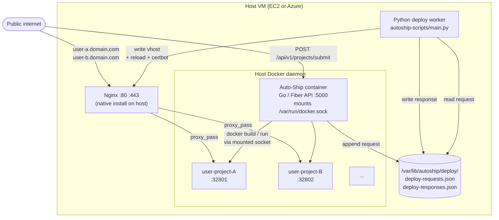

# Auto-Ship

Auto-Ship deploys a GitHub repository to a public URL. Submit a repo, Auto-Ship
figures out whether it's a static site or a long-running service, hosts it, and
returns a link.

It's a from-scratch take on what Vercel and Netlify do, built to run on a single
VM.

## How it works

1. **Submit.** The user posts a repo URL and (for dynamic projects) a start
   command. The Go backend clones the repo locally.
2. **Classify.** `DetectProjectType` looks for `package.json` with a `start`
   script, backend entrypoints (`server.js`, `app.js`, `main.go`), or a plain
   `index.html` to decide between `dynamic` and `static`.
3. **Static path.** The build output is uploaded to S3 (or Azure Blob) and
   served from there.
4. **Dynamic path.** The backend detects the runtime (Node, Python, Go),
   generates a Dockerfile, builds the image, boots a throwaway container to
   sniff the bound port via `netstat`, reserves a free host port in MongoDB,
   opens that port on the cloud firewall, and runs the final container with a
   `-p hostPort:containerPort` mapping.
5. **Route.** The Go backend appends a JSON record to
   `/var/lib/autoship/deploy/deploy-requests.json`. A Python worker
   (`autoship-scripts/`) picks it up, writes an Nginx vhost for the assigned
   subdomain, issues a Let's Encrypt cert via certbot, and writes back to
   `deploy-responses.json`. The backend polls for the response and returns the
   URL to the user.

## Architecture

Everything runs on one VM (EC2 or Azure).



User-project containers are **siblings** of the Auto-Ship container, not
children. Auto-Ship reaches the host's Docker daemon through a bind-mounted
socket and tells it to launch sibling containers on the same daemon.

## Stack

- **Backend:** Go, Fiber, MongoDB
- **Frontend:** Next.js, Tailwind, Radix UI
- **Reverse proxy:** Nginx (installed on the host, not containerised)
- **TLS:** certbot + Let's Encrypt
- **Cloud:** AWS or Azure, selected via `CLOUD_PROVIDER=aws|azure`. Only the
  object-storage upload and firewall-rule calls are cloud-specific; everything
  else is provider-agnostic.

## Repo layout

```
autoship-server/    Go backend (Fiber API, Docker orchestration)
autoship-client/    Next.js frontend
autoship-scripts/   Python deploy worker (Nginx + certbot)
setup_instance.sh   One-shot VM bootstrap (Docker, Nginx, pull + run image)
```

## Running it

The backend is shipped as `ashmit1020/autoship:<tag>`. `setup_instance.sh`
installs Docker and Nginx on a fresh Amazon Linux box, pulls the image, and
runs it. You'll need a `.env` with at minimum:

- `PORT`
- `MONGO_URI`
- `JWT_SECRET`, `JWT_EXPIRATION`
- `CLOUD_PROVIDER` (`aws` or `azure`) plus the credentials for that provider
- `DOMAIN` (the parent domain that subdomains are issued under)
- `HOST_PUBLIC_IP` (the host's public IP, used for fallback URL construction)

The container expects `/var/run/docker.sock` and `/var/lib/autoship/deploy/` to
be bind-mounted from the host.

## Status

Pre-release. Single-VM deployment, no horizontal scaling, no per-container
resource limits, no sandboxing of user code beyond Docker's defaults. Suitable
for trusted users and demos, not for arbitrary public submissions.
